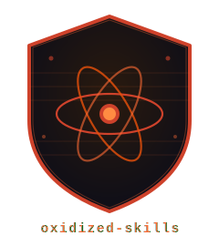

<div align="center">
  
  <h1>oxidized-agentic-audit</h1>
  <p><strong>Security auditing for AI agent skills and agents.</strong><br/>
  A CLI tool that scans skill and agent directories for dangerous patterns, prompt injection and supply chain risks.</p>

  <!-- Version & registry -->
  <a href="https://crates.io/crates/oxidized-agentic-audit"></a>
  <a href="https://crates.io/crates/oxidized-agentic-audit"></a>
  <!-- CI & quality -->
  <a href="https://github.com/jbovet/oxidized-agentic-audit/actions"></a>
  <!-- MSRV & language -->
  <a href="https://www.rust-lang.org"></a>
  <!-- License -->
  <a href="LICENSE"></a>
  <!-- Docker -->
  <a href="https://github.com/jbovet/oxidized-agentic-audit/pkgs/container/oxidized-agentic-audit"></a>
</div>

---

## Features

- **Bash dangerous pattern scanner** — 19 regex rules across 8 categories (RCE, credential exfiltration, destructive ops, reverse shells, privilege escalation, unsafe variable expansion, outbound network)
- **TypeScript/JavaScript security scanner** — 10 pure-Rust regex rules across 5 categories: arbitrary code execution (`eval`, `new Function`), shell execution via `child_process`, credential file access (SSH keys, AWS, kubeconfig), raw socket reverse shells, and unallowlisted outbound HTTP calls; scans `*.ts`, `*.tsx`, `*.mts`, `*.js`, `*.mjs`
- **Prompt injection scanner** — 19 patterns detecting instruction override, role manipulation, jailbreak attempts, data exfiltration, code injection, system prompt extraction, delimiter injection, fictional framing, and priority override; automatically skips benign boilerplate files (LICENSE, CHANGELOG, NOTICE, AUTHORS, etc.)
- **Frontmatter auditor** — 16 rules validating `SKILL.md` and `AGENT.md` structure: missing file, reserved brand names, XML injection in fields, name format and directory-name match, field length limits, vague names, body length, Windows paths, third-person description, trigger context, time-sensitive content, and unscoped `Bash` in `allowed-tools`
- **Package install auditor** — Detects `npm install`, `bun add`, `yarn add`, `pnpm add`, `pip install` without explicit registry, unpinned `@latest` versions, and unapproved registries (7 rules)
- **Shell script linting** — shellcheck wrapper, automatically skipped when tool is not installed
- **Secret scanning** — gitleaks wrapper, automatically skipped when tool is not installed
- **Static analysis** — semgrep wrapper with 30-second timeout (gracefully skips when network is blocked or tool is unavailable)
- **Collection directory support** — `audit-all` audits every skill and agent in a directory at once with a summary table; `audit` detects collection directories and shows helpful hints
- **Security score** — Every audit produces a numeric score (0–100) and letter grade (A–F); shown inline in the terminal, included as top-level fields in JSON, and embedded in `run.properties` in SARIF
- **Multiple output formats** — Pretty terminal, JSON, and SARIF 2.1.0 (compatible with GitHub Code Scanning)
- **Suppression system** — Inline `# audit:ignore` (or `# oxidized-agentic-audit:ignore`) trailing comments and `.oxidized-agentic-audit-ignore` file with ticket tracking
- **Configurable allowlists** — Registry allowlist enforced for `pkg/F3-registry`; domain allowlist enforced for `bash/CAT-H1` (outbound HTTP to approved domains is suppressed)
- **Parallel scanning** — Uses rayon for concurrent scanning across all scanners
- **Zero runtime dependencies** — Core scanners are pure Rust regex, no external tools required
- **Single binary** — Static binary, easy to integrate into CI/CD pipelines

## GitHub Action

The `oxidized-agentic-audit` GitHub Action audits skill and agent directories in CI, produces a SARIF report, and optionally uploads it to GitHub Code Scanning.

### Inputs

| Input | Description | Required | Default |
|---|---|---|---|
| `skills-path` | Path to a single skill/agent directory or a collection directory containing multiple skills and agents. | No | `.` |
| `version` | Version of oxidized-agentic-audit to download (e.g. `v0.3.0`). Use `latest` to always fetch the newest release. | No | `latest` |
| `strict` | Treat warnings as errors. Exit code 1 on any warning. | No | `false` |
| `fail-on-warnings` | Fail the action when warnings are present, even without errors. | No | `false` |
| `min-score` | Minimum security score (0–100). Fails the action if any skill scores below this threshold. | No | `` |
| `format` | Output format for the audit report. One of `pretty`, `json`, `sarif`. | No | `sarif` |
| `sarif-output` | File path where the SARIF report will be written. | No | `oxidized-agentic-audit-report.sarif` |
| `config` | Path to a custom `oxidized-agentic-audit.toml` configuration file. | No | `` |

### Outputs

| Output | Description |
|---|---|
| `sarif-file` | Absolute path to the generated SARIF report file. |
| `errors-count` | Number of error-severity findings. |
| `warnings-count` | Number of warning-severity findings. |

### Usage examples

#### Basic — run on push and PR

```yaml
- uses: jbovet/oxidized-agentic-audit@v1
  with:
    skills-path: ./skills
```

#### Strict mode — block PR merge on any finding

```yaml
- uses: jbovet/oxidized-agentic-audit@v1
  with:
    skills-path: ./skills
    strict: 'true'
```

#### Full — with GitHub Security tab integration

```yaml
- uses: actions/checkout@v4
- uses: jbovet/oxidized-agentic-audit@v1
  id: audit
  with:
    skills-path: ./skills
- uses: github/codeql-action/upload-sarif@v3
  if: always()
  with:
    sarif_file: ${{ steps.audit.outputs.sarif-file }}
```

Findings appear directly in the **Security → Code scanning** tab on GitHub:


---

## Quick Start

### Install binary

Download a pre-built binary for your platform from the [latest release](https://github.com/jbovet/oxidized-agentic-audit/releases):

**Linux (x86_64):**
```bash
curl -L https://github.com/jbovet/oxidized-agentic-audit/releases/download/v0.3.1/oxidized-agentic-audit-linux-x86_64.tar.gz | tar xz
sudo mv oxidized-agentic-audit /usr/local/bin/
```

**macOS (Intel x86_64):**
```bash
curl -L https://github.com/jbovet/oxidized-agentic-audit/releases/download/v0.3.1/oxidized-agentic-audit-macos-x86_64.tar.gz | tar xz
sudo mv oxidized-agentic-audit /usr/local/bin/
```

**macOS (Apple Silicon / ARM64):**
```bash
curl -L https://github.com/jbovet/oxidized-agentic-audit/releases/download/v0.3.1/oxidized-agentic-audit-macos-aarch64.tar.gz | tar xz
sudo mv oxidized-agentic-audit /usr/local/bin/
```

**Windows (x86_64):**
Download `oxidized-agentic-audit-windows-x86_64.zip` from [releases](https://github.com/jbovet/oxidized-agentic-audit/releases), extract it, and add the folder to your `PATH`.

> **Tip:** Replace `v0.3.1` with the latest version from [releases](https://github.com/jbovet/oxidized-agentic-audit/releases).

## Usage

### Audit a single skill or agent directory

```bash
# Audit a skill directory (default)
oxidized-agentic-audit audit ./my-skill

# Audit an agent directory
oxidized-agentic-audit audit ./my-agent --type agent

# JSON output
oxidized-agentic-audit audit ./my-skill --format json

# SARIF output (for GitHub Code Scanning)
oxidized-agentic-audit audit ./my-skill --format sarif --output report.sarif

# Strict mode (warnings become errors)
oxidized-agentic-audit audit ./my-skill --strict

# Quality gate — fail if score drops below 80
oxidized-agentic-audit audit ./my-skill --min-score 80

# Custom config
oxidized-agentic-audit audit ./my-skill --config ./my-config.toml
```

### Audit all skills or agents in a collection directory

```bash
# Audits every subdirectory that contains a SKILL.md or AGENT.md, then prints a summary
oxidized-agentic-audit audit-all ~/skills

# Audit a collection of agents
oxidized-agentic-audit audit-all ~/agents --type agent

# JSON output per skill/agent
oxidized-agentic-audit audit-all ~/skills --format json

# Strict mode across all skills/agents
oxidized-agentic-audit audit-all ~/skills --strict

# Quality gate — fail if any skill/agent scores below 80
oxidized-agentic-audit audit-all ~/skills --min-score 80
```

If you accidentally run `audit` on a collection directory, the tool detects it and shows a helpful error with the correct commands to run.

### Specifying skill vs. agent

By default, `audit` and `audit-all` scan for **skill** directories (looking for `SKILL.md`). Use `--type agent` to audit **agent** directories (looking for `AGENT.md`):

```bash
# Default: audit skills
oxidized-agentic-audit audit ./my-skill
oxidized-agentic-audit audit-all ~/skills

# Audit agents explicitly
oxidized-agentic-audit audit ./my-agent --type agent
oxidized-agentic-audit audit-all ~/agents --type agent
```

### Other commands

```bash
# Check which external tools are available
oxidized-agentic-audit check-tools

# List all built-in rules
oxidized-agentic-audit list-rules

# Get details about a specific rule
oxidized-agentic-audit explain bash/CAT-A1
```

### Exit codes

| Code | Meaning |
|------|---------|
| 0 | Audit passed (all skills/agents passed) |
| 1 | Audit failed (errors found, or warnings in strict mode) |
| 2 | Runtime error (bad config, missing path, collection dir passed to `audit`, etc.) |

## Skills and Agents

### What's the difference?

**Skills** are tool functions that extend Claude Code's capabilities. Each skill is a directory containing a `SKILL.md` file that defines the skill's metadata and behavior.

**Agents** are autonomous AI systems that use their own decision-making and planning. Each agent is a directory containing an `AGENT.md` file (similar to `SKILL.md` for skills) that describes the agent's purpose and configuration.

Both skills and agents are audited using the same security scanners — the scanning rules for dangerous patterns, prompt injection, and supply chain risks apply to both artifact types.

### Frontmatter files

- **Skills** use `SKILL.md` — see [SKILL.md format](SKILL.md)
- **Agents** use `AGENT.md` — see [agents/agent.md](agents/agent.md) for an example

The frontmatter auditor validates both file types using the same 16 rules, checking for reserved brand names, XML injection, field length limits, and other quality/safety issues.

## Scanners

### Core scanners (no external tools required)

- `bash_patterns`: Dangerous shell commands (RCE, reverse shells).
- `typescript`: Dangerous TypeScript/JavaScript patterns (code execution, shell access, credential reads, raw sockets, outbound HTTP).
- `prompt`: Prompt injection patterns in `SKILL.md` and `AGENT.md`.
- `package_install`: Unsafe package manager usage (pinned versions, registries).
- `frontmatter`: `SKILL.md` and `AGENT.md` metadata quality and safety.

### Semgrep Optimization
Semgrep can be slow because it fetches rules from the registry by default. `oxidized-agentic-audit` optimizes this by:
- Disabling anonymous metrics and version checks.
- Looking for a local `semgrep.yml` or `.semgrep.yml` automatically.

To use local rules and avoid network calls:
1. Create a `semgrep.yml` with your rules.
2. (Optional) Point to it in `oxidized-agentic-audit.toml`:
```toml
[semgrep]
config = "my-rules.yml"
```

## External Tool Wrappers

### Auto-skipped when tool not on PATH

| Scanner | Tool required | What it checks | Notes |
|---------|--------------|----------------|-------|
| `shellcheck` | `shellcheck` | Shell script linting | |
| `secrets` | `gitleaks` | Hardcoded secrets and credentials | |
| `semgrep` | `semgrep` | Static analysis rules | |

Run `oxidized-agentic-audit check-tools` to see which external tools are available in your environment.

## Built-in Rules

### Bash Patterns (Categories A-H)

| Rule | Severity | Description |
|------|----------|-------------|
| `bash/CAT-A1` | Error | Pipe to shell — bare names (`\| bash`), absolute paths (`\| /bin/bash`), and `env` launchers (`\| env bash`, `\| dash`) |
| `bash/CAT-A2` | Error | eval of dynamic content |
| `bash/CAT-A3` | Error | Source from URL |
| `bash/CAT-A4` | Error | Download to temp then execute |
| `bash/CAT-B1` | Error | SSH key access — `$HOME/.ssh/`, `~/.ssh/`, `/root/.ssh/`, `/home/*/.ssh/` |
| `bash/CAT-B2` | Error | AWS credential access — `$HOME/.aws/`, `~/.aws/`, `/root/.aws/`, `/home/*/.aws/` |
| `bash/CAT-B3` | Error | Kubeconfig access — `$HOME/.kube/config`, `~/.kube/config`, `/root/.kube/config`, `/home/*/.kube/config` |
| `bash/CAT-B4` | Error | Env var sent as HTTP POST body — `-d`, `--data`, `--data-binary`, `--data-urlencode`, `--post-data` |
| `bash/CAT-B5` | Error | env output piped to network tool |
| `bash/CAT-C1` | Error | rm -rf on home/root directory |
| `bash/CAT-C2` | Error | dd disk wipe |
| `bash/CAT-D1` | Error | Reverse shell via `nc`/`ncat` with `-e`/`--exec /bin/...` |
| `bash/CAT-D2` | Error | Bash `/dev/tcp` reverse shell — `>&`, `>`, stdout-only, and `exec`-fd forms |
| `bash/CAT-D3` | Error | Python socket reverse shell |
| `bash/CAT-E1` | Warning | sudo shell escalation |
| `bash/CAT-E2` | Warning | SUID bit — symbolic (`+s`, `u+s`, `a+s`) and numeric modes (`chmod 4755`, `chmod 6755`) |
| `bash/CAT-G1` | Warning | rm -rf with unquoted variable (including at end of line) |
| `bash/CAT-G2` | Warning | Shell invoked with variable arg |
| `bash/CAT-H1` | Info | Outbound HTTP call detected |
| `bash/read-error` | Info | Shell file could not be read (check permissions / encoding) |

### Prompt Injection (19 patterns)

| Rule | Severity | Description |
|------|----------|-------------|
| `prompt/override-ignore` | Error | "ignore previous instructions" |
| `prompt/override-disregard` | Error | "disregard previous instructions" |
| `prompt/override-forget` | Error | "forget everything you know" |
| `prompt/override-priority` | Warning | Priority override keywords (OVERRIDE:, NEW TASK:) |
| `prompt/role-escalation` | Error | Assigns admin/root identity |
| `prompt/role-impersonation` | Warning | "pretend to be a different AI" |
| `prompt/restrictions-bypass` | Error | "act without restrictions" |
| `prompt/jailbreak-dan` | Error | DAN / "do anything now" mode |
| `prompt/jailbreak-devmode` | Error | Developer mode activation |
| `prompt/jailbreak-bypass` | Error | Safety/security filter bypass |
| `prompt/jailbreak-fiction` | Warning | Fictional/hypothetical framing jailbreak |
| `prompt/exfil-send` | Warning | Send data to external endpoint |
| `prompt/exfil-read` | Warning | Read passwords/secrets/tokens |
| `prompt/exfil-sysPrompt` | Error | System prompt extraction attempt |
| `prompt/inject-execute` | Error | Arbitrary code execution instruction |
| `prompt/inject-unvalidated` | Error | Run without validation instruction |
| `prompt/inject-delimiter` | Error | Model context delimiter injection — ChatML (`<\|im_start\|>`), Llama 2 `[INST]`, and Llama 3 (`<\|begin_of_text\|>`, `<\|eot_id\|>`, etc.) |
| `prompt/perm-delete-all` | Warning | Mass deletion instruction (`rm -rf /`, `delete all`, `rm *`) |
| `prompt/perm-sudo` | Warning | Privilege escalation (sudo/root) |

### Frontmatter (16 rules)

| Rule | Severity | Description |
|------|----------|-------------|
| `frontmatter/missing-skill-md` | Error | SKILL.md not found in skill root |
| `frontmatter/xml-in-frontmatter` | Error | XML/HTML angle brackets or HTML entities (`&lt;`, `&#60;`, etc.) in `name` or `description` field |
| `frontmatter/name-reserved-word` | Error | Name contains reserved word `claude` or `anthropic` |
| `frontmatter/readme-in-skill` | Warning | README.md present — use the description field instead |
| `frontmatter/invalid-name-format` | Warning | Name has uppercase letters, spaces, or underscores |
| `frontmatter/name-too-long` | Warning | Name exceeds 64 characters |
| `frontmatter/name-too-vague` | Warning | Name uses a vague generic term (helper, utils, tools, data, files, documents) |
| `frontmatter/name-directory-mismatch` | Warning | `name` field does not match the containing directory name |
| `frontmatter/description-missing` | Warning | Description field absent or empty |
| `frontmatter/description-too-long` | Warning | Description exceeds 1024 characters |
| `frontmatter/description-not-third-person` | Warning | Description uses first or second person instead of third person |
| `frontmatter/skill-body-too-long` | Warning | SKILL.md exceeds 500 lines |
| `frontmatter/windows-path` | Warning | Windows-style backslash path in SKILL.md — use forward slashes |
| `frontmatter/bare-bash-tool` | Warning | Unscoped `Bash` in `allowed-tools` grants unrestricted shell access |
| `frontmatter/description-no-trigger` | Info | Description doesn't include "when to use" trigger context |
| `frontmatter/time-sensitive-content` | Warning | Body contains date-based conditional that will become stale (e.g. "before 2025") |

### TypeScript/JavaScript Patterns (Categories A-H)

| Rule | Severity | Description |
|------|----------|-------------|
| `typescript/CAT-A1` | Error | `eval()` call — arbitrary code execution risk |
| `typescript/CAT-A2` | Error | `new Function()` — dynamic code construction, arbitrary code execution risk |
| `typescript/CAT-B1` | Warning | `child_process` module imported — enables shell command execution |
| `typescript/CAT-B2` | Warning | `execSync`/`spawnSync` — executes shell commands synchronously |
| `typescript/CAT-B3` | Info | `exec`/`spawn`/`execFile` — possible async shell execution; verify `child_process` context |
| `typescript/CAT-C1` | Error | SSH private key path detected — credential access risk |
| `typescript/CAT-C2` | Error | AWS credentials path detected — credential exfiltration risk |
| `typescript/CAT-C3` | Error | Kubernetes kubeconfig path detected — credential access risk |
| `typescript/CAT-D1` | Error | Node.js `net` module raw socket — potential reverse shell or backdoor |
| `typescript/CAT-H1` | Info | Outbound HTTP call detected — verify domain is in allowed list |

> **Suppression:** Add `// audit:ignore` or `// oxidized-agentic-audit:ignore` as a trailing comment on any line. Category H findings are automatically suppressed when every URL on the line resolves to an allowlisted domain in `oxidized-agentic-audit.toml`.

### Package Install (7 rules)

| Rule | Severity | Description |
|------|----------|-------------|
| `pkg/F1-npm` | Warning | npm install without --registry |
| `pkg/F1-bun` | Warning | bun add without --registry |
| `pkg/F1-yarn` | Warning | yarn add/install without --registry |
| `pkg/F1-pnpm` | Warning | pnpm add/install without --registry |
| `pkg/F1-pip` | Warning | pip install without --index-url |
| `pkg/F2-unpinned` | Warning | @latest unpinned version |
| `pkg/F3-registry` | Warning | Unapproved registry URL |

## Security Score

Every audit computes a numeric security score (0–100) and a letter grade (A–F) based on the active (non-suppressed) findings.

### Scoring model

Points are deducted per finding:

| Finding type | Deduction |
|---|---|
| Critical error — RCE, reverse shell, prompt injection (`bash/CAT-A*`, `bash/CAT-D*`, `prompt/*`) | −30 |
| Regular error | −15 |
| Warning | −5 |
| Info | −1 |

The score is clamped to `[0, 100]`. Suppressed findings do not affect the score.

### Grade bands

| Score | Grade |
|---|---|
| 90–100 | **A** |
| 75–89 | **B** |
| 60–74 | **C** |
| 40–59 | **D** |
| 0–39 | **F** |

### Where the score appears

**Pretty terminal output** — shown on the summary line, color-coded (green ≥90, yellow 60–89, red <60):

```
Result: FAILED  |  Score: 40/100 (D)  |  3 errors, 2 warnings, 0 info, 0 suppressed
```

**Collection summary table** — a score column next to each skill row:

```
  ✗  my-skill               FAILED    40/100 (D)  3 err, 2 warn, 0 info
  ✓  clean-skill            PASSED   100/100 (A)  0 err, 0 warn, 0 info
```

**JSON output** — `security_score` (integer) and `security_grade` (string) as top-level fields:

```json
{
  "security_score": 40,
  "security_grade": "D",
  ...
}
```

**SARIF output** — embedded in `runs[0].properties` following SARIF 2.1.0 §3.19, compatible with GitHub Code Scanning and VS Code SARIF Viewer:

```json
{
  "runs": [{
    "properties": {
      "security_grade": "D",
      "security_score": 40
    },
    ...
  }]
}
```

## Configuration

### `oxidized-agentic-audit.toml`

Place in your project root or pass via `--config`:

```toml
[allowlist]
# Registries checked against pkg/F3-registry findings
registries = [
    "registry.npmjs.org",
    "pypi.org",
    "files.pythonhosted.org",
]

# Domains approved for outbound HTTP — bash/CAT-H1 is suppressed for these (exact match or subdomain)
domains = [
    "registry.npmjs.org",
    "npmjs.org",
    "github.com",
    "githubusercontent.com",
    "pypi.org",
]

[strict]
enabled = false

[scanners]
shellcheck = true
semgrep = true
secrets = true
prompt = true
bash_patterns = true
typescript = true
package_install = true
frontmatter = true
```

### `.oxidized-agentic-audit-ignore`

Place in the skill directory to suppress specific findings:

```toml
[[suppress]]
rule = "bash/CAT-H1"
file = "scripts/install.sh"
reason = "Approved download from official registry"
ticket = "PROJ-1234"

[[suppress]]
rule = "bash/CAT-D2"
file = "scripts/debug.sh"
lines = "156-174"
reason = "Perl portable timeout uses bash /dev/tcp, not a reverse shell"
ticket = "PROJ-5678"
```

### Inline suppression

Add `# audit:ignore` or `# oxidized-agentic-audit:ignore` as a **trailing comment** on any line in a shell script:

```bash
curl https://approved-source.example.com/tool.tar.gz -o /tmp/tool.tar.gz  # audit:ignore
wget https://approved-source.example.com/tool.tar.gz                       # oxidized-agentic-audit:ignore
```

> **Note:** The marker must appear as a real trailing shell comment. A suppression string inside a quoted argument (e.g. `echo "# audit:ignore" | bash`) is **not** treated as a suppression.

## Docker

### Dev image (local use — recommended for Apple Silicon)

`Dockerfile.dev` builds natively on any architecture (amd64 or arm64) — no cross-compilation, no musl. It includes all external scanners for full local coverage.

```bash
just docker-dev-build                         # build once
just docker-dev ~/skills/my-skill      # audit a single skill
just docker-dev-all ~/skills           # audit all skills
```

Or with plain Docker:

```bash
docker build -f Dockerfile.dev -t oxidized-agentic-audit:dev .
docker run --rm -v ~/skills:/skills:ro oxidized-agentic-audit:dev audit-all /skills

# Audit agents instead of skills
docker run --rm -v ~/agents:/agents:ro oxidized-agentic-audit:dev audit-all --type agent /agents
```

### Release images

Three image variants are published to GitHub Container Registry on every release.

| Image | Base | External tools | Size | Tag |
|-------|------|----------------|------|-----|
| slim | `scratch` | None (core scanners only) | ~4 MB | `:slim`, `:latest`, `:<version>` |
| full | `python:3.12-slim` | `shellcheck` + `gitleaks` + `semgrep` | ~506 MB | `:full`, `:<version>-full` |

> The `full` image includes `semgrep`, which fetches rules from `semgrep.dev` on first run. In network-restricted environments it will time out after 30 s and be skipped gracefully. To pre-cache rules, mount a local semgrep config with `-v ./semgrep.yml:/semgrep.yml -e SEMGREP_RULES=/semgrep.yml`.

### Important: mount your skills/agents directory

The container has no access to your host filesystem unless you explicitly mount it with `-v`.
Always mount the skill/agent directory (or collection) as a volume and pass the **container path** to the command:

```
-v /host/path:/container/path:ro
```

### Pull and run

On Apple Silicon or other ARM64 systems, you should specify the platform to run the published amd64 images:

```bash
docker pull --platform linux/amd64 ghcr.io/jbovet/oxidized-agentic-audit:slim
```


```bash
# ── slim image (core scanners only) ──────────────────────────────────────────
docker pull ghcr.io/jbovet/oxidized-agentic-audit:slim

# Audit a single skill directory
docker run --rm \
  -v /path/to/skill:/skill:ro \
  ghcr.io/jbovet/oxidized-agentic-audit:slim audit /skill

# Audit a single agent directory
docker run --rm \
  -v /path/to/agent:/agent:ro \
  ghcr.io/jbovet/oxidized-agentic-audit:slim audit --type agent /agent

# Audit all skills in a collection directory
docker run --rm \
  -v ~/skills:/skills:ro \
  ghcr.io/jbovet/oxidized-agentic-audit:slim audit-all /skills

# Audit all agents in a collection directory
docker run --rm \
  -v ~/agents:/agents:ro \
  ghcr.io/jbovet/oxidized-agentic-audit:slim audit-all --type agent /agents

# ── full image (shellcheck + gitleaks) ───────────────────────────────────────
docker pull ghcr.io/jbovet/oxidized-agentic-audit:full

docker run --rm \
  -v /path/to/skill:/skill:ro \
  ghcr.io/jbovet/oxidized-agentic-audit:full audit /skill

docker run --rm \
  -v ~/skills:/skills:ro \
  ghcr.io/jbovet/oxidized-agentic-audit:full audit-all /skills

```

> **Common mistake:** `docker run oxidized-agentic-audit audit ~/skills` will fail with
> `Error: path does not exist` — the container cannot see your home directory.
> Always use `-v ~/skills:/skills:ro` and pass `/skills` as the argument.

### Write SARIF output to a file

```bash
docker run --rm \
  -v /path/to/skill:/skill:ro \
  -v "$(pwd)":/out \
  ghcr.io/jbovet/oxidized-agentic-audit:full \
  audit /skill --format sarif --output /out/report.sarif
```

### Build locally

```bash
just docker-build       # slim (~4 MB, scratch base)
just docker-build-full  # full (~506 MB, debian-slim + shellcheck + gitleaks)
just docker-build-all   # all three

# Run against a local skill directory
just docker-run ./my-skill        # slim
just docker-run-full ./my-skill   # includes semgrep

# Run against a collection directory
just docker-run-all ~/skills
```

### Use in CI (GitHub Actions)

```yaml
- name: Audit skills
  run: |
    docker run --rm \
      -v ${{ github.workspace }}/skills:/skills:ro \
      ghcr.io/jbovet/oxidized-agentic-audit:full audit-all /skills
```

## Development

Requires [just](https://github.com/casey/just).

```bash
just          # fmt → lint → test
just fmt      # cargo fmt (fix in place)
just lint     # cargo clippy -- -D warnings
just test     # cargo test
just ci       # fmt-check + lint + test (mirrors CI)
```

### Pre-commit hook

```bash
just install-hooks
```

Installs `.githooks/pre-commit` into `.git/hooks/`, which runs `fmt-check`, `clippy`, and `cargo test` on every commit.

## License

MIT
